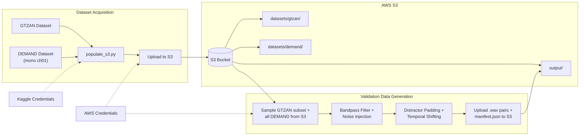

# Audio Data Processing Pipeline

```mermaid
flowchart LR
    subgraph Acquisition["Dataset Acquisition"]
        A["GTZAN Dataset"] --> B["populate_s3.py"]
        C["DEMAND Dataset<br>(mono ch01)"] --> B
        B --> D["Upload to S3"]
    end

    subgraph Storage["AWS S3"]
        D --> E[("S3 Bucket")]
        E --> F["datasets/gtzan/"]
        E --> G["datasets/demand/"]
        E --> H["output/"]
    end

    subgraph Generation["Validation Data Generation"]
        E --> I["Sample GTZAN subset +<br>all DEMAND from S3"]
        I --> J["Bandpass Filter +<br>Noise Injection"]
        J --> K["Distractor Padding +<br>Temporal Shifting"]
        K --> L["Upload .wav pairs +<br>manifest.json to S3"]
        L --> H
    end

    M["AWS Credentials"] -.-> D
    M -.-> I
    N["Kaggle Credentials"] -.-> B
```
